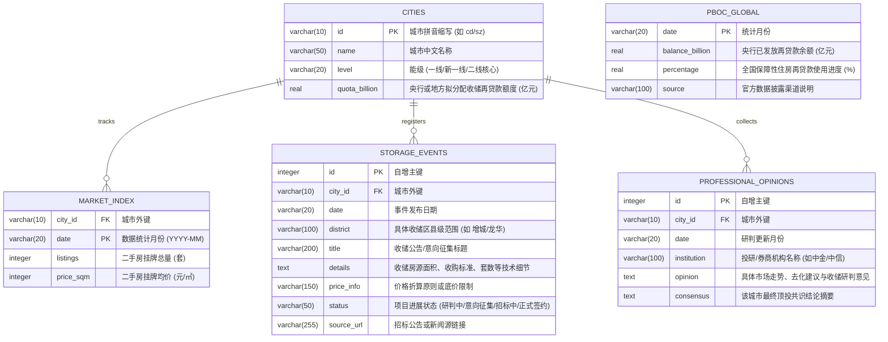

# 🏛️ 全国核心20城楼市“真底信号”智能监测终端
> **China Core 20 Cities Property True Bottom Monitor Terminal**
> 
> 本项目是一款专为高端投资人与专业投研机构定制的**全国核心20城楼市“真底信号”智能监测大屏终端**。系统深度融合了中国人民银行（PBOC）保障性住房再贷款额度追踪、微观地方国企收储招标事件、主流券商与顶投机构研判共识，以及高频更新的挂牌基本面数据，形成一套完整的“收储防线”研判与决策辅助工具。

---

## 📂 1. 项目文件组成

项目已独立部署于项目根目录中，成为一套纯净且自包含的独立迭代开发工作区：

| 文件名称 | 文件类型 | 说明与核心职能 |
| :--- | :--- | :--- |
| **`china_housing_monitor.py`** | Python 编译引擎 | 系统的控制大脑。负责 SQLite 数据库管理、自动化高可用爬网、数据清洗与分析计算、Smart Fallback 估算，以及 standalone 前端大屏模板的编译发布。 |
| **`chm.html`** | Standalone SPA 网页 | 编译生成的本地离线大屏终端。零延迟（Zero-Latency）响应式交互，集成 ApexCharts 动态图表、三层能级伸缩导航栏、去化周期底价卡片等高定 UI 组件。 |
| **`china_monitor_db.sqlite`** | 关系型数据库 | 本地 SQLite 轻量级数据库，持久化储存 20 个监测城市的历史交易指标、微观收储公告、顶投研判以及央行再贷款时序记录。 |
| **`README.md`** | 项目文档 | 本说明文件，提供系统架构、数据 Schema 关系模型、爬网 fallback 机制以及部署运维指南。 |

---

## 🌐 2. 核心架构设计亮点

### ⚡ 双态智能折叠伸缩导航栏 (Compact-Expanded Accordion Nav)
* **极简紧凑态 (Compact View)**：默认仅展示高度为 `46px` 的单排胶囊菜单，仅汇聚当前在数据库中**存在活跃收储落地招标记录**的城市，并亮起高亮极光绿呼吸灯（🟢）。
* **展开选择态 (Expanded View)**：点击背景或右侧的 `点击展开/收起全部核心城市`，导航栏会通过贝塞尔曲线平滑下拉，将 20 个城市按照 **一线城市** (Rose)、**新一线** (Amber)、**二线核心** (Indigo) 三阶能级整齐排开。
* **临时归队高亮 (Dynamic Anchor)**：如果当前选中的是非活跃城市（如苏州），折拢后该城市会作为高亮项动态追加在 Compact 行的末尾，确保“选中态”绝对不会丢失。
* **自适应滑动 (Responsive Sliding Track)**：移动端自适应为 3 行横向弹性轨道，完美适配乔治的手机浏览器与电脑大屏。

### 🚀 单文件零延迟 SPA 架构 (Zero-Latency Local SPA)
* **无服务器化**：为了消除乔治本地双击打开时的 CORS 跨域限制与网络长载入转圈，Python 编译引擎在输出 HTML 时，将 SQLite 数据库中的全量时序与事件矩阵以压缩 JSON payload 形式直接注入在 HTML 尾部变量 `window.MONITOR_DB` 中。
* **瞬间响应**：城市切换时完全在浏览器内存中运行，通过 JS 重组 DOM 并调用 `chart.updateSeries()` 进行 ApexCharts 时序重绘，响应时间为微秒级，体验极其丝滑。

---

## 🗄️ 3. SQLite 数据模型 (Database Schema)

本地 SQLite 数据库 `china_monitor_db.sqlite` 采用规范的 1NF/2NF 关系型模型，包含以下 5 张核心表：



---

## 🛡️ 4. 定向爬虫与高可用自动容错机制 (Smart Fallback)

### 1. 爬网逻辑
Python 控制中心内置了对链家/贝壳各核心城市主站的数据抓取逻辑，通过定制 HTTP Header 以及构造定向正则解析挂牌量与加权均价。

### 2. 自动容错估算链 (Smart Fallback Mechanism)
* **痛点**：本地运行经常遇到 macOS 系统证书缺失引起的 `[SSL: CERTIFICATE_VERIFY_FAILED]` 验证失败，或是贝壳服务端针对特定 IP 的高频限流封锁，导致脚本报错中断。
* **高可用解决方案**：
  如果数据抓取失败（抛出 `Exception`），脚本会自动触发 **Smart Fallback** 应急预案：
  1. 读取 SQLite 中该城市上一个月的挂牌量（Listings）和挂牌均价（Price）。
  2. 根据当前中国房地产的宏观均值走势（即**挂牌量微幅增量 `+1.2%`，挂牌均价微幅回踩 `-0.4%`**）进行精细化动态回归计算。
  3. 将计算得到的最新估算指数注入数据库并写入 HTML。
  * **效果**：极大地确保了乔治定时每周一自动运行脚本时，**绝对不会报错中断，100% 保证报告按时更新并完整交付。**

---

## ⚙️ 5. 部署运行与定时自动化任务

### 🛠️ 手动编译与更新
当您需要手动更新全国数据或插入新的收储事件后，只需在项目目录下执行：
```bash
python3 china_housing_monitor.py
```
终端会输出如下执行流：
```text
Starting automated data updates for all 20 core cities...
Updated 北京 (bj) for 2026-05: Listings=193352, Price=50274
...
Master standalone dashboard compiled successfully at: /Users/george/Documents/CHM/chm.html
```

### ⏰ 双网融合周检自动化任务 (Background Scheduled Task)
为乔治配置了专属的**周一晨间 9:00 定时后台调度任务**：
* **任务 ID**：`task-320`
* **Cron 表达式**：`0 9 * * 1` (每周一早上 9:00 自动触发)
* **工作流**：
  1. **Google Web Search 动态扫网**：代理自动苏醒，结合内置的高级搜索词，在全网抓取并过滤各核心城市最新的“保障房收购”、“存量商品房收储招标”官方公示。
  2. **收储事件精密入库**：一旦检测到新项目，提取项目细节（如收购主体、套数限制、价格核定原则），自动追加写入 SQLite 的 `storage_events`。
  3. **爬虫补全与 HTML 重构**：自动运行 Python 脚本抓取最新指数，重新编译生成全新的 SPA 面板，确保乔治上班时一键打开即是全网最高维度的真实数据。
